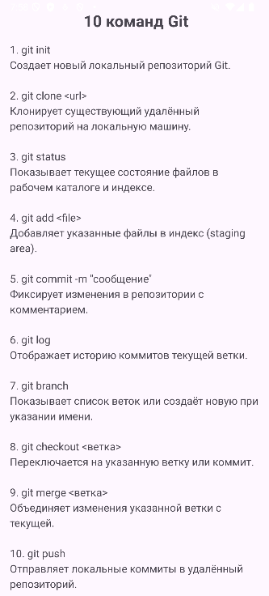

# 📜 GitCommandsApp — Описание 10 команд Git

**GitCommandsApp** — это простое Android-приложение на Java, которое отображает описание 10 базовых команд Git внутри прокручиваемого списка (`ScrollView`).

---

## 🚀 Возможности
- 📖 Отображение 10 популярных команд Git  
- 🧭 Прокрутка текста с помощью `ScrollView`  
- 💡 Минималистичный интерфейс без сторонних библиотек

---

## ⚙️ Технологии
- Java  
- Android SDK 36  
- ScrollView + TextView  
- LinearLayout  

---

## 📁 Структура проекта
```
app/
├── java/com/example/gitcommands/MainActivity.java
├── res/layout/activity_main.xml
└── AndroidManifest.xml
```

---

## 🔧 Запуск
1. Импортировать проект в **Android Studio**  
2. Убедиться, что `compileSdk` и `targetSdk` = 36  
3. Собрать и запустить приложение на эмуляторе или устройстве



---

## 🪪 Лицензия
Проект создан в учебных целях и свободен к использованию.
